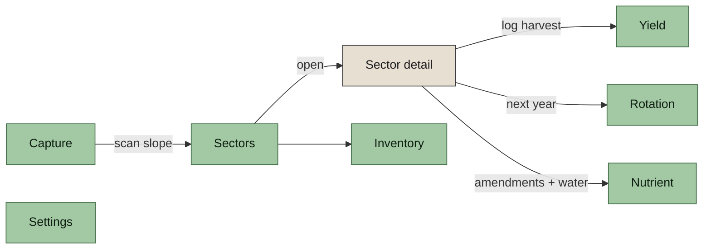
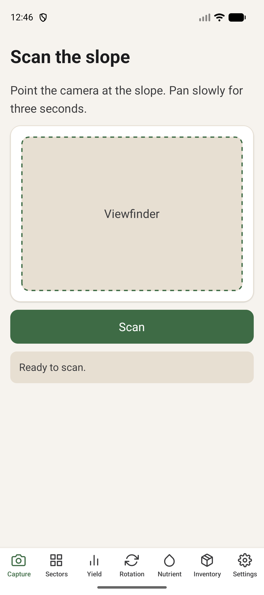
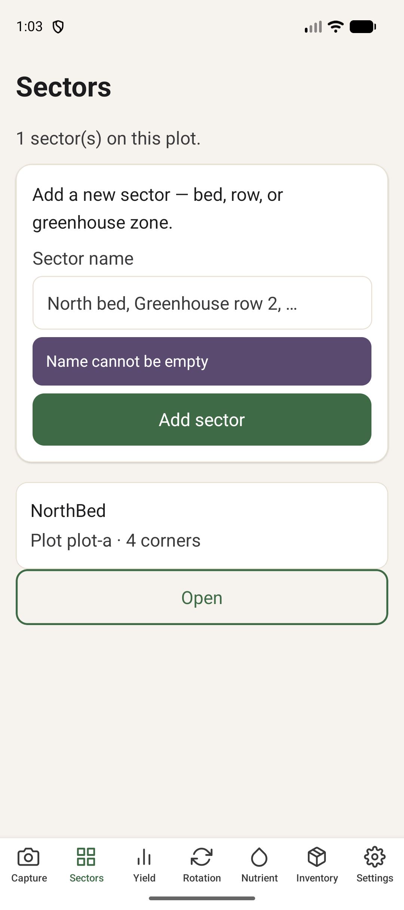
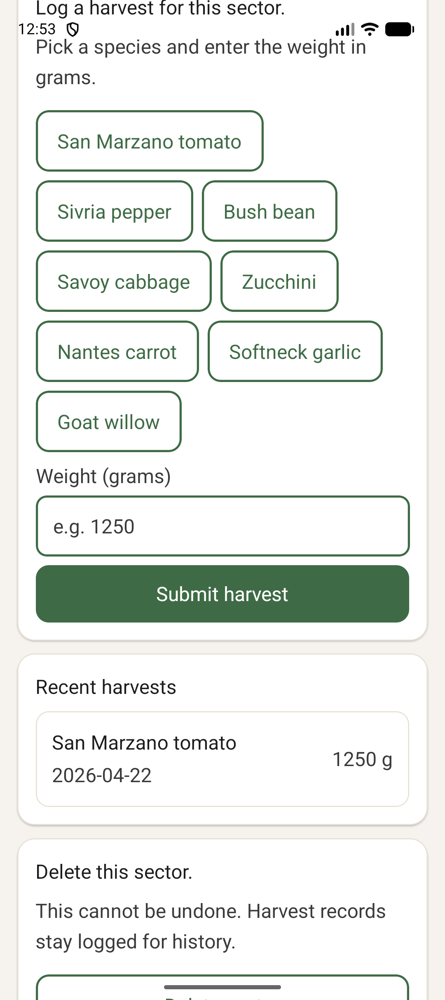
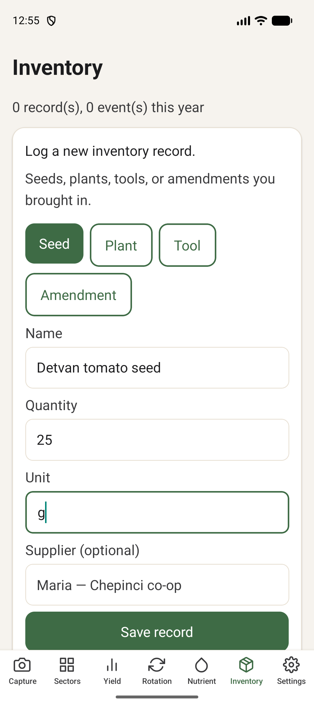
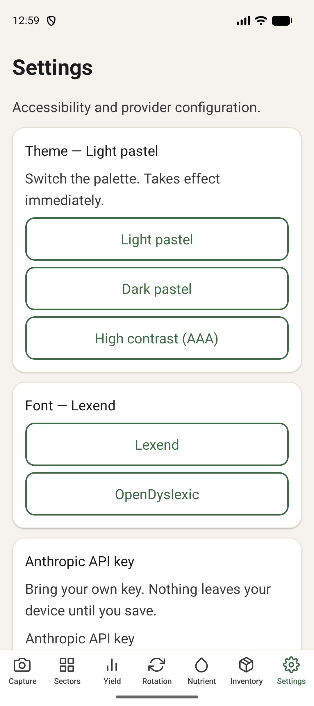
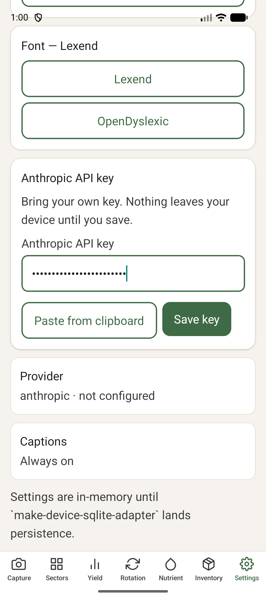
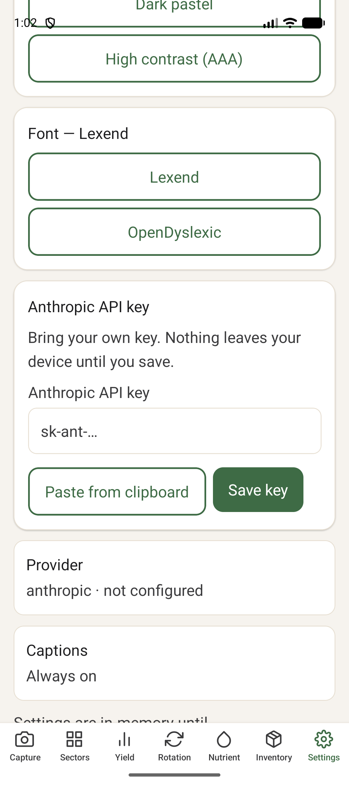
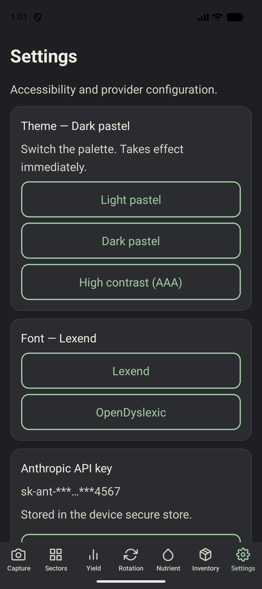
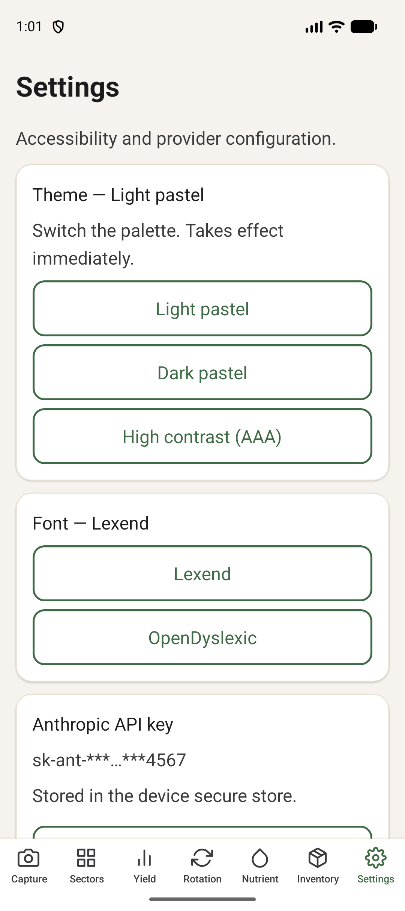

# How to use the Garden Planner

Plain-language guide. Short sentences. Written for growers who want to get things done, not programmers.

If you are here to install the app, read [SIDELOAD.md](SIDELOAD.md) first.

---

## What the app does

It is a notebook for your garden.

- It remembers every **sector** — a bed, row, or zone you care about.
- It remembers every **harvest** you log.
- It remembers every **event** — what you sowed, what pests you saw, when soil was sampled.
- It remembers every **inventory record** — seeds you bought, plants you raised, tools you own, amendments you applied.
- It can call an **Anthropic** model to help you think, if you give it your own key.

Your data never leaves your phone. The reasoning key is stored in the device secure store.

> **Note.** Today the notebook resets if you reinstall the app. Real persistence lands in the follow-up change `make-device-sqlite-adapter`. Your local notes survive an app restart, not an uninstall.

---

## The seven tabs

The bottom bar has seven tabs. Tap an icon to switch.



1. **Capture** — point the camera at a slope, pan for three seconds, get a compliance verdict spoken out loud. Real camera. Real sensors.
2. **Sectors** — beds, rows, greenhouses. Add, rename, delete.
3. **Yield** — **year-over-year** table: this year vs last year per sector × species, plus a one-tap CSV export.
4. **Rotation** — what to plant next year, with citations.
5. **Nutrient** — what to amend and when to water, with citations.
6. **Inventory** — log seeds, plants, tools, amendments, and garden events.
7. **Settings** — theme, font, captions, your Anthropic key, voice + haptic toggles.

---

## How to scan a slope

The Capture tab turns a phone sweep into a compliance verdict against Sofia-basin setback / slope / water-table rules.

### First-time setup (permissions)

1. Open the **Capture** tab. The Scan button is disabled. A caption says _"Grant camera, location, and motion access to scan."_
2. Tap **Grant access**. A rationale screen appears with three rows: **Camera**, **Location**, **Motion (compass + gyroscope)**. Each row shows **Granted** or **Not granted**.
3. Tap **Grant access** on that screen. Android will show three system dialogs in sequence — one per permission. Tap **While using the app** for each.
4. Once all three say **Granted**, tap **Back to Capture**. The Scan button is now enabled.

If you later revoke a permission in Android Settings, the Capture tab will re-disable the Scan button the next time you open the app.

### Pin the property-line distance (once per plot)

Before the first scan, type the perpendicular distance (in metres) from where you are standing to the nearest property line. The input is below the viewfinder.

- This number is required for the setback rule. Without it, the verdict will be _"Pin the property line distance before requesting a compliance verdict."_ rather than a silent pass. We do not fake numbers.
- A reasonable pin for a Chepinci row house is `3` to `5` metres. Use a measuring tape or a map distance tool once; re-enter any time you stand in a different spot.

### The scan itself

1. Hold the phone at chest height with the camera facing the slope you want to assess.
2. Tap **Scan**. You have three seconds.
3. Pan the phone slowly from left to right across the slope. Keep the pan smooth — no jerks. The driver averages your pitch across the three seconds; jerky motion lowers confidence.
4. When the window ends, the compliance engine runs. One of four things happens:

   | Spoken verdict                                             | What it means                                                                                                                             |
   | ---------------------------------------------------------- | ----------------------------------------------------------------------------------------------------------------------------------------- |
   | _"Grading plan is compliant and ecologically sound."_      | Slope is below the unpermitted threshold, setback is safe, water table is deep enough.                                                    |
   | _"Slope exceeds N degrees. Micro-permit specs generated."_ | The engine has drafted a micro-permit spec and saved it to the notebook. Show it at the municipal office.                                 |
   | _"High water table detected..."_                           | Fires only if you have logged a shallow water table on the plot. The advisory tells you to plant deep-rooting shrubs before you grade.    |
   | _"Retaining wall breaches municipal setback limits."_      | Your pinned property-line distance is below the 1.5 m municipal setback. Re-pin from a compliant spot, or redesign.                       |
   | _"Pan the camera... and try again."_                       | The driver did not collect enough motion samples. You held the phone still or tapped Scan twice. Pan for three full seconds.              |

   Every verdict fires **TTS + caption + haptic** together — if the earbuds are in, you do not need to look at the screen.

5. The verdict caption sticks at the bottom of every screen for five seconds. Change tabs, it follows you.

### Turning voice or captions off

Open **Settings**. The **Voice (TTS)**, **Captions**, and **Haptics** rows are independent toggles. Turning voice off still shows the caption. Turning captions off still speaks. Turning haptics off silences the buzz but leaves everything else.

---

## How to read the year-over-year Yield table

The Yield tab compares this year's harvests against the prior year's, per sector × species.

1. Open the **Yield** tab.
2. Each row is one species in one sector. Columns show prior-year grams, current-year grams, and the signed delta (grams and percent).
3. Rows with the biggest absolute change sit at the top. A new-this-year species shows `+1000 g (new)`. A species that disappeared shows `-500 g (gone)`.
4. Rows are tinted — louder green on the heaviest yields, paler on the lightest. The numeric value is always visible too, so colour alone never carries the reading.
5. The card at the top is the plot-wide total for both years + the delta.

### Export to CSV

Scroll to the bottom of the Yield tab and tap **Export yield history**. The app writes `yield-<YYYY>.csv` to the device cache and opens the Android share sheet. Columns:

```
sectorId,speciesId,year,priorGrams,currentGrams,deltaGrams,deltaPct
```

Paste that into a spreadsheet, email it to the co-op, keep a copy on your laptop. If the device does not support sharing (rare), the file is still written to cache and the path is logged for recovery.

---

## How to add a sector

1. Open the **Sectors** tab.
2. In the top card, type a name. Try `North bed` or `Greenhouse row 2`.
3. Tap **Add sector**. It appears in the list below.

Blank names are rejected. Pick something you will recognise a year from now.

---

## How to log a harvest

1. Open the **Sectors** tab.
2. Tap **Open** next to the sector you harvested.
3. On the sector detail screen, scroll to the **Log harvest** card.
4. Tap the species you harvested. (Tomato, pepper, bean, and friends.)
5. Type the weight in grams. For example, `1250` for 1.25 kg.
6. Tap **Submit harvest**.

The **Yield** tab updates right away. Each year is tracked separately.

---

## How to rename or delete a sector

1. Open the sector from the Sectors tab.
2. In the **Rename this sector** card, type a new name and tap **Save name**.
3. To delete, scroll to the bottom. Tap **Delete sector**. It cannot be undone.

Old harvests stay in the year-over-year history even after the sector is gone.

---

## How to log an inventory record

Use this when you bring something new to the garden — a packet of seeds, a tray of seedlings, a tool, an amendment.

1. Open the **Inventory** tab.
2. In the top card, pick the kind: **Seed**, **Plant**, **Tool**, or **Amendment**.
3. Fill in the **Name**, **Quantity**, **Unit**, and optional **Supplier**.
4. Tap **Save record**.

Quantity must be a number greater than zero. Unit is free text — `g`, `kg`, `pcs`, whatever you think.

---

## How to log a garden event

Use this when something happens in a sector — you sowed, transplanted, saw a pest, took a soil sample, had a plant fail, or corrected a previous mistake.

1. Open the **Inventory** tab.
2. Scroll to the **Log a garden event** card.
3. Pick the **Kind**: Sowed, Transplanted, Pest observed, Soil sample, Plant failure, Correction.
4. Pick the **Sector** the event happened in. (If you have no sectors, the app sends you to Sectors first.)
5. Optionally pick a **Species**. Optionally type a **Note**.
6. Tap **Log event**.

Events are append-only. A mistake is corrected by logging a **Correction** event — never by editing history.

---

## How to change the theme

1. Open the **Settings** tab.
2. Pick **Light pastel**, **Dark pastel**, or **High contrast (AAA)**.

The whole app re-colours immediately.

- **Light pastel** — default, easy on the eyes in daylight.
- **Dark pastel** — the same palette, inverted.
- **High contrast (AAA)** — black on white, maximum legibility.

---

## How to change the font

1. Open the **Settings** tab.
2. Pick **Lexend** or **OpenDyslexic**.

Lexend is the default. OpenDyslexic is free and designed for dyslexic readers.

---

## How to save your Anthropic API key

The key powers optional reasoning suggestions. Without a key, the app still works — it just has no model to call.

1. Copy your key from anthropic.com. It starts with `sk-ant-`.
2. Open the **Settings** tab. Scroll to **Anthropic API key**.
3. Tap **Paste from clipboard**. The key appears in the field, hidden as dots.
4. Tap **Save key**.

You then see the key masked — `sk-ant-***…***<last 4 chars>`. The app has stored it in the device secure store.

To remove it, tap **Clear key**.

The plaintext key never appears in any list or page of the app after you save.

---

## Screenshots

Captured from the Pixel 9 emulator running the actual app:

| Flow                                       | Screenshot                                                                   |
| ------------------------------------------ | ---------------------------------------------------------------------------- |
| Capture tab                                |                               |
| Sectors — empty                            |                       |
| Sector added                               |                         |
| Empty-name rejection                       |  |
| Sector detail (rename + harvest form)      |                       |
| Harvest logged                             |                     |
| Yield tab — 1.3 kg roll-up                 |                                   |
| Inventory tab — empty                      |                   |
| Inventory record form filled               |               |
| Recent records + events                    |                      |
| Settings                                   |                         |
| Anthropic key typed (secureTextEntry dots) |                      |
| Key saved (masked + Clear)                 |                      |
| Key cleared (back to paste state)          |                  |
| Theme — Dark pastel live-switch            |                            |
| Theme — High contrast AAA                  |                                     |
| Theme — Light pastel                       |                          |

---

## If something does not work

- **The Scan button is disabled and grey.** A permission is missing. Tap **Grant access** in the caption beneath the button to open the rationale screen, then grant all three permissions. Come back. The button enables without a restart.
- **Scan says _"Pan the camera across the slope for three full seconds and try again."_** You held the phone still, your device has no motion sensor (rare), or you tapped Scan twice. Pan slowly for three full seconds.
- **Scan says _"Pin the property line distance..."_** Type the metres into the box above the button, then re-tap Scan. The engine refuses to emit a setback verdict without a user-confirmed pin.
- **The verdict is silent.** Check Settings: Voice (TTS), Captions, Haptics each have their own switch. At least one should be on. On a muted phone, TTS falls through to the system speaker-off default — turn media volume up.
- **The Yield tab shows nothing.** Log at least one harvest on a sector. If the tab still blanks, restart the app. Data is in-memory until `make-device-sqlite-adapter` ships — a full reinstall wipes it.
- **CSV export says _"Sharing not available..."_** The file was still written. Connect the phone to a PC with USB-C, open the garden-planner cache folder, and copy the file. This is a fallback for emulators and some stripped-down Android ROMs.
- **Theme does not flip.** Make sure you tapped a different theme. (The current one is already active.)
- **Paste does nothing.** Android requires you to have actually copied text. Open your password manager or notes app, copy the key, return to Settings.
- **Anything else.** Open an issue at the repo. Accessibility regressions are fixed fast.
