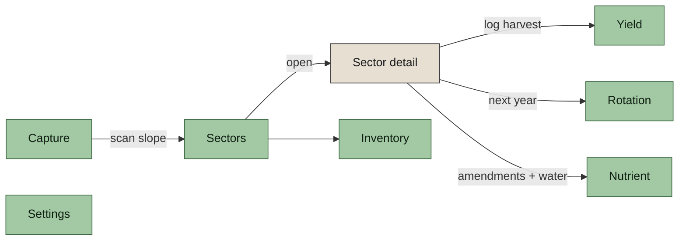

# How to use the Garden Planner

Plain-language guide. Short sentences. Written for growers who want to get things done, not programmers.

If you are here to install the app, read [SIDELOAD.md](SIDELOAD.md) first.

---

## What the app does

It is a notebook for your garden.

- It remembers every **sector** — a bed, row, or zone you care about.
- It remembers every **harvest** you log.
- It remembers every **event** — what you sowed, what pests you saw, when soil was sampled.
- It remembers every **inventory record** — seeds you bought, plants you raised, tools you own, amendments you applied.
- It can call an **Anthropic** model to help you think, if you give it your own key.

Your data never leaves your phone. The reasoning key is stored in the device secure store.

> **Note.** Today the notebook resets if you reinstall the app. Real persistence lands in the follow-up change `make-device-sqlite-adapter`. Your local notes survive an app restart, not an uninstall.

---

## The seven tabs

The bottom bar has seven tabs. Tap an icon to switch.

1. **Capture** — point the camera at a slope to read topography. (Camera live preview lands in a later change; for now the tab guides you.)
2. **Sectors** — beds, rows, greenhouses. Add, rename, delete.
3. **Yield** — total kilograms grown per sector per year.
4. **Rotation** — what to plant next year, with citations.
5. **Nutrient** — what to amend and when to water, with citations.
6. **Inventory** — log seeds, plants, tools, amendments, and garden events.
7. **Settings** — theme, font, captions, your Anthropic key.

---

## How to add a sector

1. Open the **Sectors** tab.
2. In the top card, type a name. Try `North bed` or `Greenhouse row 2`.
3. Tap **Add sector**. It appears in the list below.

Blank names are rejected. Pick something you will recognise a year from now.

---

## How to log a harvest

1. Open the **Sectors** tab.
2. Tap **Open** next to the sector you harvested.
3. On the sector detail screen, scroll to the **Log harvest** card.
4. Tap the species you harvested. (Tomato, pepper, bean, and friends.)
5. Type the weight in grams. For example, `1250` for 1.25 kg.
6. Tap **Submit harvest**.

The **Yield** tab updates right away. Each year is tracked separately.

---

## How to rename or delete a sector

1. Open the sector from the Sectors tab.
2. In the **Rename this sector** card, type a new name and tap **Save name**.
3. To delete, scroll to the bottom. Tap **Delete sector**. It cannot be undone.

Old harvests stay in the year-over-year history even after the sector is gone.

---

## How to log an inventory record

Use this when you bring something new to the garden — a packet of seeds, a tray of seedlings, a tool, an amendment.

1. Open the **Inventory** tab.
2. In the top card, pick the kind: **Seed**, **Plant**, **Tool**, or **Amendment**.
3. Fill in the **Name**, **Quantity**, **Unit**, and optional **Supplier**.
4. Tap **Save record**.

Quantity must be a number greater than zero. Unit is free text — `g`, `kg`, `pcs`, whatever you think.

---

## How to log a garden event

Use this when something happens in a sector — you sowed, transplanted, saw a pest, took a soil sample, had a plant fail, or corrected a previous mistake.

1. Open the **Inventory** tab.
2. Scroll to the **Log a garden event** card.
3. Pick the **Kind**: Sowed, Transplanted, Pest observed, Soil sample, Plant failure, Correction.
4. Pick the **Sector** the event happened in. (If you have no sectors, the app sends you to Sectors first.)
5. Optionally pick a **Species**. Optionally type a **Note**.
6. Tap **Log event**.

Events are append-only. A mistake is corrected by logging a **Correction** event — never by editing history.

---

## How to change the theme

1. Open the **Settings** tab.
2. Pick **Light pastel**, **Dark pastel**, or **High contrast (AAA)**.

The whole app re-colours immediately.

- **Light pastel** — default, easy on the eyes in daylight.
- **Dark pastel** — the same palette, inverted.
- **High contrast (AAA)** — black on white, maximum legibility.

---

## How to change the font

1. Open the **Settings** tab.
2. Pick **Lexend** or **OpenDyslexic**.

Lexend is the default. OpenDyslexic is free and designed for dyslexic readers.

---

## How to save your Anthropic API key

The key powers optional reasoning suggestions. Without a key, the app still works — it just has no model to call.

1. Copy your key from anthropic.com. It starts with `sk-ant-`.
2. Open the **Settings** tab. Scroll to **Anthropic API key**.
3. Tap **Paste from clipboard**. The key appears in the field, hidden as dots.
4. Tap **Save key**.

You then see the key masked — `sk-ant-***…***<last 4 chars>`. The app has stored it in the device secure store.

To remove it, tap **Clear key**.

The plaintext key never appears in any list or page of the app after you save.

---

## Screenshots

Captured from the Pixel 9 emulator running the actual app:

| Flow                                       | Screenshot                                                                   |
| ------------------------------------------ | ---------------------------------------------------------------------------- |
| Capture tab                                |                               |
| Sectors — empty                            |                       |
| Sector added                               |                         |
| Empty-name rejection                       |  |
| Sector detail (rename + harvest form)      |                       |
| Harvest logged                             |                     |
| Yield tab — 1.3 kg roll-up                 |                                   |
| Inventory tab — empty                      |                   |
| Inventory record form filled               |               |
| Recent records + events                    |                      |
| Settings                                   |                         |
| Anthropic key typed (secureTextEntry dots) |                      |
| Key saved (masked + Clear)                 |                      |
| Key cleared (back to paste state)          |                  |
| Theme — Dark pastel live-switch            |                            |
| Theme — High contrast AAA                  |                                     |
| Theme — Light pastel                       |                          |

---

## If something does not work

- **The Yield tab does not show my harvest.** Pull back to the Yield tab. Tap around. Tanstack-query refetches. If still blank, restart the app.
- **Theme does not flip.** Make sure you tapped a different theme. (The current one is already active.)
- **Paste does nothing.** Android requires you to have actually copied text. Open your password manager or notes app, copy the key, return to Settings.
- **Anything else.** Open an issue at the repo. Accessibility regressions are fixed fast.
