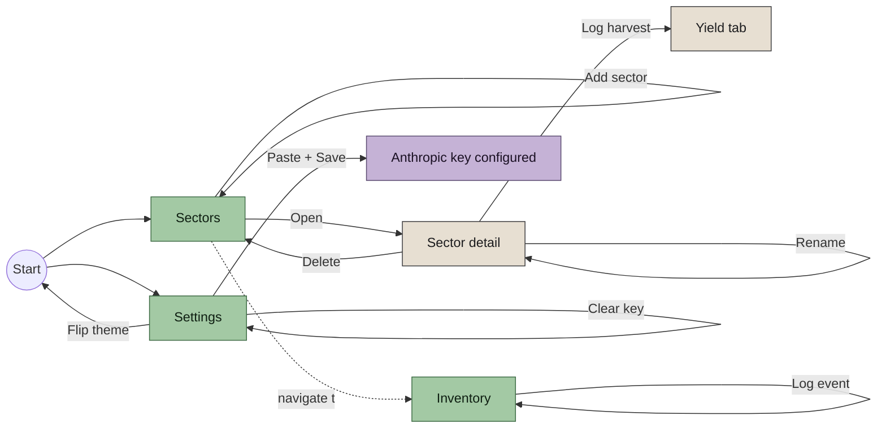
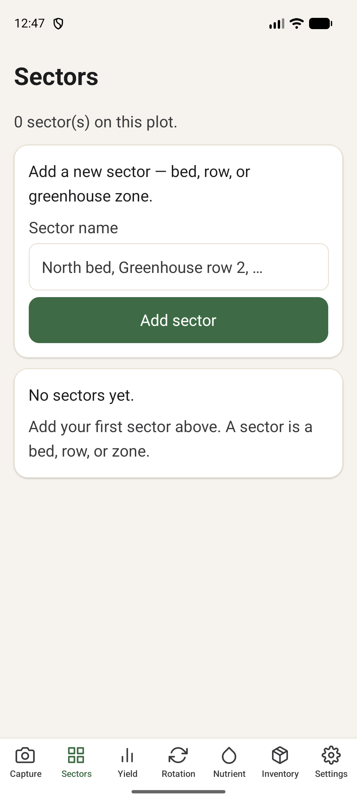
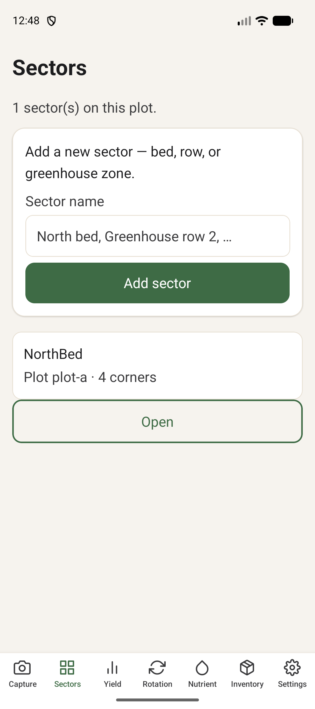
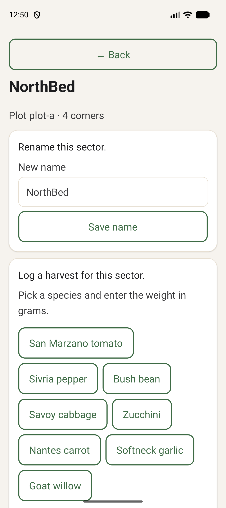
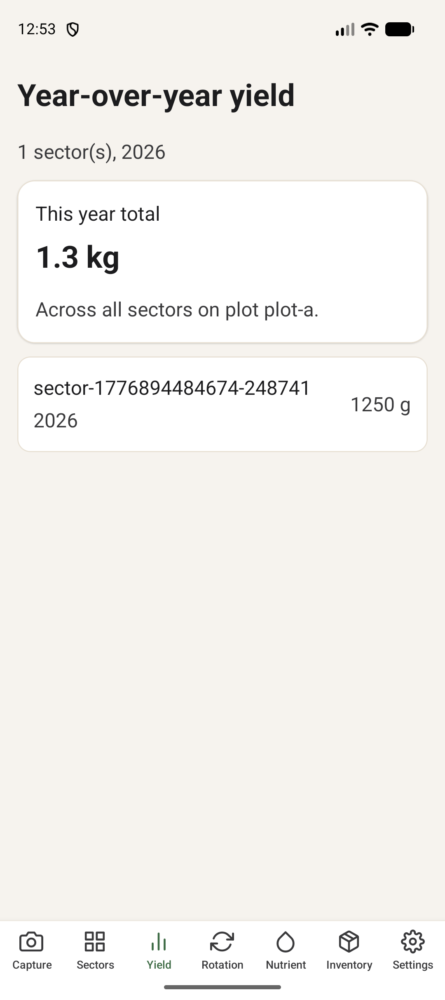
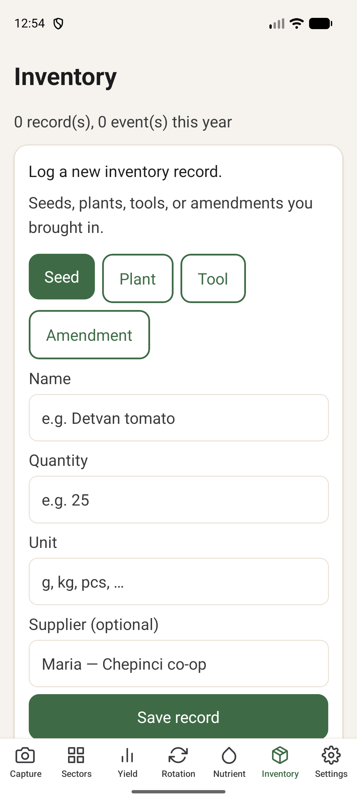
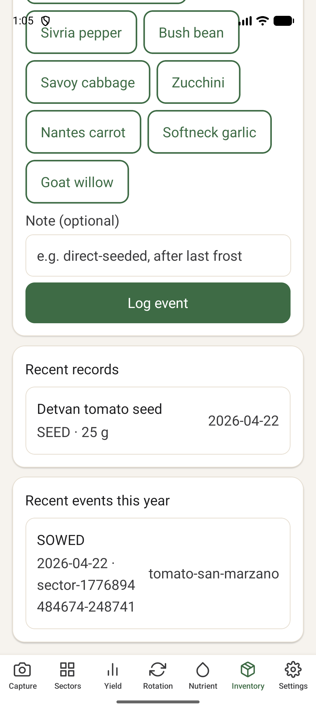
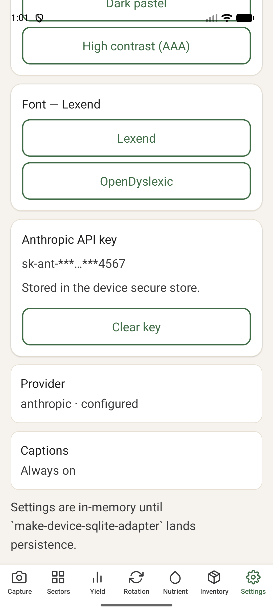
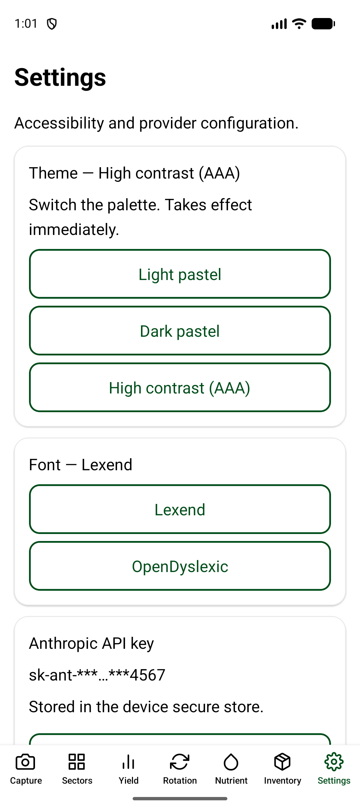
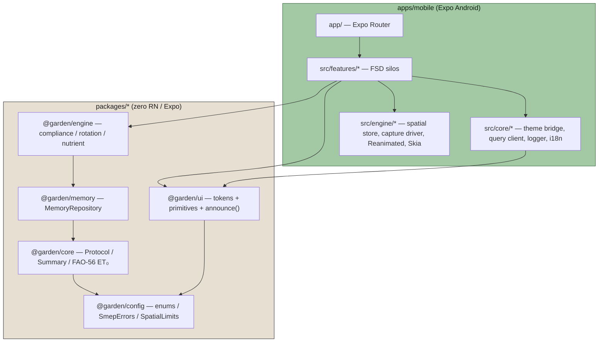

# Garden Planner

Garden Planner is an Android app for small home growers and farmers. Point your phone at a garden bed, keep a harvest log, and get science-backed rotation and watering advice — all without internet or subscriptions. Works offline, no internet needed. Built for growers in Chepinci (Sofia basin, Bulgaria) but usable anywhere.

> **Note:** Bulgarian language support is currently showing placeholder text — a native translation is in progress.

> **Demo video:** [Watch the end-to-end walkthrough](docs/demo/end-to-end.mp4)

## What can I do today?

- ✅ **Photograph your plot** — point the camera at a garden bed to capture its slope and orientation. The app turns that scan into a planting record.
- ✅ **Create sectors from a scan** — after scanning, tap "Create sector from this scan" to save the bed with its measured data attached.
- ✅ **Log a harvest** — open a sector, tap "Log harvest", enter the weight. The app keeps a running history per bed and per crop.
- ✅ **See year-over-year yield** — the Yield tab shows a two-column comparison of this year vs last year, with a CSV export you can share.
- ✅ **Get a rotation recommendation** — the Rotation tab tells you which crop family to plant next in each bed and why, citing agronomic sources.
- ✅ **Check your irrigation target** — the Nutrient tab calculates a weekly watering target in millimetres using a scientific formula (FAO-56) that estimates how much water your plants need.
- ✅ **Hear verdicts spoken aloud** — every action is announced via text-to-speech, a caption bar, and a haptic vibration. All three channels can be turned on or off in Settings.
- ✅ **Control permissions and sound in Settings** — the Settings screen shows camera and location permission status and lets you grant them from one place. Sound is off by default; turn it on whenever you are ready.

> **Note:** App data is stored in memory only. It will be lost if you reinstall the app. Permanent storage is in progress.

---

> **Reality check.** This README describes what actually ships. Read **[docs/STATUS.md](docs/STATUS.md)** before trusting any claim — it is the ground truth with `file:line` evidence. If the two disagree, STATUS wins.
>
> Shipped today (tested, reproducible on emulator): sectors CRUD, harvest log, **real two-column year-over-year yield table with CSV export**, inventory records + events, rotation advisor, irrigation target (using a scientific formula, FAO-56, that estimates how much water your plants need), paste your own Anthropic AI key, theme live-switch, **real camera capture (expo-camera + your phone's motion sensors + Location) gated behind a permissions rationale screen**, **voice output (TTS + haptics + persistent caption bar) fired on every mutation**, splash-screen handshake, **home dashboard**, **capture-to-sector flow**, **sound opt-in**, **permissions card in Settings**.
>
> Designed but **not yet wired** (tracked in OpenSpec changes): STT voice input (`make-voice-stt-real`), Skia/Reanimated overlays (`make-spatial-overlay-real`), SQLite persistence (`make-device-sqlite-adapter`), native BG translations (reviewer sign-off).

## Run it

```bash
pnpm install
pnpm dev                 # picks phone > emulator, builds debug APK, tails Metro
pnpm dev release         # install the prebuilt release APK — no Metro
pnpm sideload            # install the release APK on a plugged-in phone
pnpm dev:stop            # kill Metro + emulator
```

`pnpm dev` sources env, runs `doctor.sh`, boots the Pixel AVD if no device is attached, forces the Metro URL to `localhost:8081` over `adb reverse`, installs the debug APK, and tails the Metro log. Ctrl+C stops only the tail — Metro keeps running.

### Drive and verify the running app

```bash
scripts/adb-ui.sh grant                 # grant camera + location runtime perms
scripts/adb-ui.sh tap-tab capture       # deep-link to a tab
scripts/adb-ui.sh tap "Open viewfinder" # tap by accessibility label / visible text
scripts/adb-ui.sh shot capture-verdict  # → docs/screenshots/capture-verdict.png
scripts/adb-ui.sh alive                 # PID=<n> or exit 1
scripts/adb-ui.sh watch 60              # scoped FATAL / OOM / app-died watcher
```

The label resolver parses `uiautomator` dumps, so it never misses a button. Tab switching uses `gardenplanner://` deep-links — more reliable than hitting a 154-px tab target. Every UI change must land with a proof PNG under `docs/screenshots/` plus a post-sequence `alive` — a screenshot can look fine while the process has just been OOM-killed.

Everything else is one layer below:

- **[HOW-TO.md](HOW-TO.md)** — plain-language walkthrough of every flow (add a sector, log a harvest, paste your Anthropic key, change the theme).
- **[SIDELOAD.md](SIDELOAD.md)** — ten-step Android phone sideload guide.
- **[COMMANDS.md](COMMANDS.md)** — every `pnpm` root script + every `scripts/*.sh`.
- **[docs/app-flow.md](docs/app-flow.md)** — dev narrative: capture → verdict → sector → sow → harvest → rotation → nutrient.
- **[QUICKSTART.md](QUICKSTART.md)** — ten-step developer quickstart (host toolchain + APK build).
- **[BUILDING.md](BUILDING.md)** — install JDK + Android SDK + gradle APK build.
- **[CLAUDE.md](CLAUDE.md)** — conventions, architecture, LLM-edit guardrails.
- **[ACCESSIBILITY.md](ACCESSIBILITY.md)** — reviewer sign-off ledger; release gate.
- **[openspec/changes/](openspec/changes/)** — the spec-driven design trail for every change.

## What makes this different — vision vs. what ships

A standard SaaS garden planner lets you drag cartoon trees over a 2D grid and assumes your soil is perfect and your climate average. This one aims to negotiate the real plot you are standing on — its slope, water table, legal setbacks — and keep a permanent record of what grew, where, and how well.

Each bullet below is tagged: ✅ works today, 🟡 partial, 🔴 designed but not yet implemented. See [STATUS.md](docs/STATUS.md) for evidence.

- ✅ **Spatial capture** — opt-in live camera view, 2-second window using your phone's motion sensors (tilt and compass) fuses pitch + heading into a real scan result. No property-line distance pin means the compliance engine routes to `actionRequired` honestly instead of fabricating a verdict. Viewfinder is focus-gated and auto-closes after a scan so the app opens without streaming a frame. See `docs/screenshots/capture-opt-in.png`.
- ✅ **Compliance engine** — Sofia-basin setback / slope / water-table rules; every verdict cites its source. Pure-engine, tested. Every scan feeds a real scan result now, not a mock.
- ✅ **Rotation + irrigation advisor** — science-backed (crop families, a scientific formula (FAO-56) used to estimate how much water plants need, Kc stage curves). 🟡 Fertilizer and soil amendment suggestions UI is still a stub.
- ✅ **Voice output** — `announce()` fires TTS (`expo-speech`) + caption bar + haptic (`expo-haptics`) on every mutation. Each channel is gated by an independent Settings toggle. 🔴 **STT input is not wired** — Scan is tap-driven today; Vosk/whisper.cpp integration lives in `make-voice-stt-real`.
- ✅ **Accessibility tokens** — neutral pastel + dark + AAA high-contrast; Lexend default / OpenDyslexic opt-in; contrast audited in CI. Cross-modal contract is fired for every mutation hook.
- 🟡 **Works offline, no internet needed — paste your own Anthropic AI key** — today the notebook is an **in-memory `Map`** (lost on reinstall); SQLite adapter tracked in `make-device-sqlite-adapter`. Anthropic key _is_ persisted in `expo-secure-store` (paste + mask + clear all shipped).

## User flows that actually work today



| Flow                    | Entry point                         | What it writes                                                | Verification                                                                                                |
| ----------------------- | ----------------------------------- | ------------------------------------------------------------- | ----------------------------------------------------------------------------------------------------------- |
| Add a sector            | Sectors tab → name + Add            | `MemoryRepository.saveSector`                                 | [`sectors-screen.test.tsx`](apps/mobile/src/features/sectors/__tests__/sectors-screen.test.tsx)             |
| Open a sector           | Sectors tab → Open → `/sector/[id]` | `router.push('/sector/' + id)`                                | [`sectors-screen.test.tsx`](apps/mobile/src/features/sectors/__tests__/sectors-screen.test.tsx)             |
| Rename a sector         | Sector detail → Save name           | `renameSector`                                                | [`sector-detail-screen.test.tsx`](apps/mobile/src/features/sectors/__tests__/sector-detail-screen.test.tsx) |
| Delete a sector         | Sector detail → Danger zone         | `deleteSector` (idempotent)                                   | [`sector-harvest.test.ts`](packages/memory/src/__tests__/sector-harvest.test.ts)                            |
| Log a harvest           | Sector detail → Log harvest         | `appendHarvest` + invalidates `heatmap` / `yield`             | [`harvest-form.test.tsx`](apps/mobile/src/features/yield/__tests__/harvest-form.test.tsx)                   |
| Log an inventory record | Inventory tab → Save record         | `saveInventoryRecord`                                         | [`record-form.test.tsx`](apps/mobile/src/features/inventory/__tests__/record-form.test.tsx)                 |
| Log a garden event      | Inventory tab → Log event           | `appendEvent` (append-only)                                   | [`event-form.test.tsx`](apps/mobile/src/features/inventory/__tests__/event-form.test.tsx)                   |
| Save the Anthropic key  | Settings → Paste + Save             | `expo-secure-store` + `anthropicKeyConfigured` flip           | [`anthropic-key-field.test.tsx`](apps/mobile/src/features/settings/__tests__/anthropic-key-field.test.tsx)  |
| Flip the theme          | Settings → pick palette             | `settingsStore.setTheme` → `SettingsThemeProvider` re-renders | Manual (live-switch, see HOW-TO)                                                                            |

Screenshots for each flow live under [`docs/screenshots/`](docs/screenshots/) — captured from the running app on the Pixel 9 emulator.

|                                                             |                                                               |                                                          |                                                     |
| :---------------------------------------------------------: | :-----------------------------------------------------------: | :------------------------------------------------------: | :-------------------------------------------------: |
|      |          |   |      |
|                       Sectors — empty                       |                         Sector added                          |               Sector detail + harvest form               |               Yield — 1.3 kg roll-up                |
|  |  |  |  |
|                       Inventory form                        |                    Recent records + events                    |                   Anthropic key masked                   |                AAA theme live-switch                |

## Architecture at a glance



The four "pure" packages (`config`, `core`, `memory`, `engine`) contain **zero React Native / Expo imports** and test in plain Node. A lint rule enforces this. The UI package and the mobile app are the only places Expo / Paper / RN appear.

## Hard rules (enforced by ESLint, not by review)

These are the rules every `.ts` file obeys. Violations fail CI.

- **Imports by package name only** — `@garden/core`, never `../../packages/core/src/index`.
- **≤300 lines per file**.
- **Max 2 nesting levels** (early returns / early continues).
- **No `else if`**, **no `switch`/`case`**, **no `function` declarations** — const arrow functions only.
- **No `.js` extensions on imports**.
- **No `new Error(...)` outside `@garden/config`** — always `throw SmepErrors.xxx()`.
- **Enums from `@garden/config`** — `TaskStatus.Verified`, never `"VERIFIED"`.
- **No string-literal unions** — `const X = {...} as const; type X = (typeof X)[keyof typeof X]`. Lint rule forbids the raw `"A" | "B"` shape.
- **Types in `@garden/config`** — all shared types live there.
- **Every science-data entry carries `sourceCitation`** — CI fails on missing citations.
- **Every theme foreground/background pair meets WCAG AA (AAA for `high-contrast`)** — CI fails on regression.
- **No Redux, no Redux Toolkit, no Redux Saga** — TanStack Query + Zustand only.

## Testing philosophy

Every engine module ships with a Jest `it.each` table covering **happy / side / critical / chaos** paths.

- **Happy** — the common, well-formed input.
- **Side** — an alternate real-world shape that still resolves.
- **Critical** — a constraint-breaching input that must be rejected.
- **Chaos** — malformed input (`null`, non-finite, missing field) that must throw a typed `SmepError`.

Every feature form on device has a Node-side component test using `react-test-renderer` + a thin RN mock layer in `apps/mobile/src/__mocks__/`. Current count: `apps-mobile` 40 tests, `@garden/ui` 63 tests, 11/11 turbo tasks green.

```bash
pnpm install
pnpm check:all          # typecheck + lint + test + spell + format:check + audit:citations + audit:contrast
```

## The Expo app

Lives in `apps/mobile/`. Built with Expo Router (thin glue in `app/`) and a **Feature-Sliced Design** layout under `src/`:

```
apps/mobile/src/
├── core/         config, logger, TanStack Query client, theme bridge, i18n
├── engine/       spatial store (Zustand transient 60 Hz pose), capture driver,
│                 Reanimated worklets, Skia overlays
└── features/     self-contained feature silos, each with
                  components/ hooks/ store/ types/ index.ts
```

A feature silo is deletable (minus its route) without breaking the rest of the app. Cross-feature imports only through the feature's `index.ts`.

**State:** TanStack Query for everything through `MemoryRepository` and the reasoning provider; Zustand for client UI state; a Zustand **transient** store for the spatial pose. ⚠️ The capture driver populates the spatial store's pose-throttle output already; the Reanimated worklet and Skia canvas that consume it are not wired yet (see [STATUS.md](docs/STATUS.md) row 10).

**Theme live-switch:** the root `_layout.tsx` wraps the app in `SettingsThemeProvider` (in `apps/mobile/src/core/theme/`). The wrapper subscribes to `settingsStore.themeId` via `zustand`'s `useStore` and passes the active id into `@garden/ui`'s `ThemeProvider`. Flipping the theme in Settings re-renders every mounted screen without a restart. `@garden/ui` stays decoupled from the mobile settings store.

**Accessibility contract:** every verdict produces TTS + caption + haptic via `announce(summary)` in `@garden/ui`. The provider is mounted in the root gate; `useAnnounce()` is the feature-side hook. Each channel has an independent Settings toggle (voice / captions / haptics) and all three are persisted.

## Honest next steps

In priority order, with OpenSpec change IDs where a design already exists:

1. **`make-voice-stt-real`** — Vosk/whisper.cpp into `useVoiceLoop`. Removes the last tap-only dependency from the capture flow.
2. **`make-device-sqlite-adapter`** — `expo-sqlite` behind `SqliteLike` with numbered migrations. Closes the "data resets on reinstall" gap.
3. **`make-spatial-overlay-real`** — ship the visual map overlay (coming soon) to consume the pose-throttle output the capture driver already populates. Finally paints the green/red compliance boundary on the viewfinder.
4. **Fertilizer and soil amendment suggestions UI** — irrigation card is live; the amendment/demand diff card is a stub. Engine-side math exists.
5. **Native BG translations** — strings mirror EN with `// TODO(bg)` markers. Needs a named reviewer in `ACCESSIBILITY.md`.
6. **Agronomist sign-off** on `packages/engine/src/data/species.ts` + `nutrient/species-demand.ts` — science is cited per row; still not peer-reviewed.

`docs/STATUS.md` is the ground truth row-by-row with `file:line` evidence. Read it before trusting anything here.

## License

MIT.
