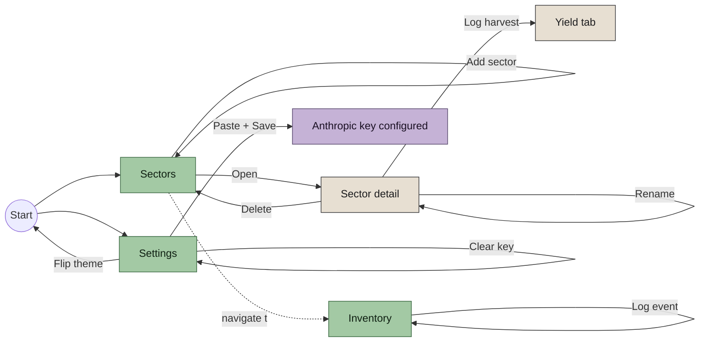
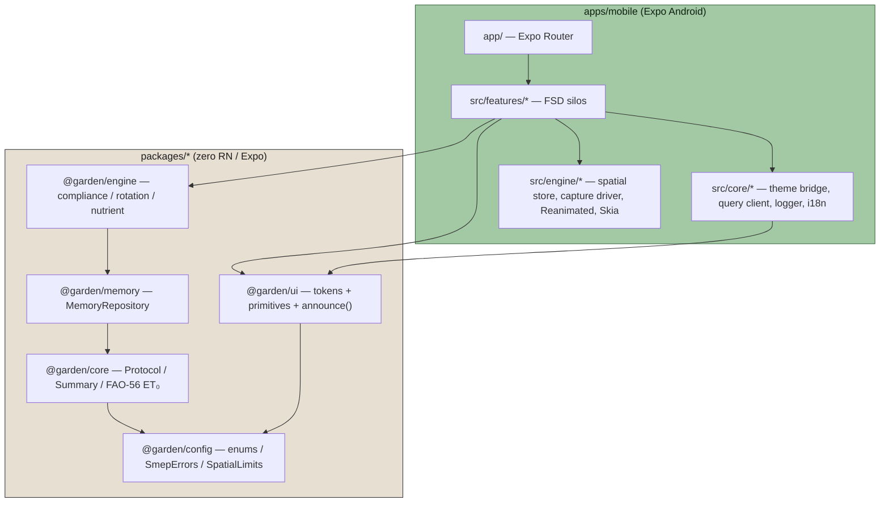

# Garden Planner

A local-first, voice-led, accessibility-first spatial garden planner.

Made first for home growers and small farmers in **Chepinci (Sofia basin, Bulgaria)**. Side-loaded as an Android `.apk`. Voice in, whisper out, camera maps the yard. Remembers sectors, year-over-year yield, and what the science says to rotate into next spring.

## Run it

```bash
pnpm install
pnpm dev
```

`pnpm dev` sources env, runs `doctor.sh`, boots the Pixel AVD if not already running, starts Metro in the background, installs the APK on the device, and tails the Metro log. Ctrl+C stops only the tail — Metro keeps running. Teardown with `pnpm dev:stop`.

Everything else is one layer below:

- **[HOW-TO.md](HOW-TO.md)** — plain-language walkthrough of every flow (add a sector, log a harvest, paste your Anthropic key, change the theme).
- **[SIDELOAD.md](SIDELOAD.md)** — ten-step Android phone sideload guide.
- **[COMMANDS.md](COMMANDS.md)** — every `pnpm` root script + every `scripts/*.sh`.
- **[docs/app-flow.md](docs/app-flow.md)** — dev narrative: capture → verdict → sector → sow → harvest → rotation → nutrient.
- **[QUICKSTART.md](QUICKSTART.md)** — ten-step developer quickstart (host toolchain + APK build).
- **[BUILDING.md](BUILDING.md)** — install JDK + Android SDK + gradle APK build.
- **[CLAUDE.md](CLAUDE.md)** — conventions, architecture, LLM-edit guardrails.
- **[ACCESSIBILITY.md](ACCESSIBILITY.md)** — reviewer sign-off ledger; release gate.
- **[openspec/changes/](openspec/changes/)** — the spec-driven design trail for every change.

## What makes this different

A standard SaaS garden planner lets you drag cartoon trees over a 2D grid and assumes your soil is perfect and your climate average. This one negotiates the real plot you are standing on — its slope, its water table, its legal setbacks — and keeps a permanent record of what grew, where, and how well.

- **Spatial capture** — pan the camera, get a `Protocol` (slope, orientation, water-table depth, confidence).
- **Compliance engine** — Sofia-basin setback / slope / water-table rules; every verdict cites its source.
- **Rotation + nutrient advisor** — science-backed (crop families, Liebig's Law, FAO-56 Penman-Monteith ET₀).
- **Voice-first, always-captioned** — earbuds in, phone in pocket; captions for every spoken word.
- **Accessibility as baseline** — neutral pastel + dark + AAA high-contrast; Lexend default / OpenDyslexic opt-in; cross-modal redundancy.
- **Local-first, BYOK** — pure-JS in-memory repo today (SQLite follow-up); Anthropic key in `expo-secure-store`; nothing leaves the phone without consent.

## User flows that actually work today



| Flow                    | Entry point                         | What it writes                                                | Verification                                                                                                |
| ----------------------- | ----------------------------------- | ------------------------------------------------------------- | ----------------------------------------------------------------------------------------------------------- |
| Add a sector            | Sectors tab → name + Add            | `MemoryRepository.saveSector`                                 | [`sectors-screen.test.tsx`](apps/mobile/src/features/sectors/__tests__/sectors-screen.test.tsx)             |
| Open a sector           | Sectors tab → Open → `/sector/[id]` | `router.push('/sector/' + id)`                                | [`sectors-screen.test.tsx`](apps/mobile/src/features/sectors/__tests__/sectors-screen.test.tsx)             |
| Rename a sector         | Sector detail → Save name           | `renameSector`                                                | [`sector-detail-screen.test.tsx`](apps/mobile/src/features/sectors/__tests__/sector-detail-screen.test.tsx) |
| Delete a sector         | Sector detail → Danger zone         | `deleteSector` (idempotent)                                   | [`sector-harvest.test.ts`](packages/memory/src/__tests__/sector-harvest.test.ts)                            |
| Log a harvest           | Sector detail → Log harvest         | `appendHarvest` + invalidates `heatmap` / `yield`             | [`harvest-form.test.tsx`](apps/mobile/src/features/yield/__tests__/harvest-form.test.tsx)                   |
| Log an inventory record | Inventory tab → Save record         | `saveInventoryRecord`                                         | [`record-form.test.tsx`](apps/mobile/src/features/inventory/__tests__/record-form.test.tsx)                 |
| Log a garden event      | Inventory tab → Log event           | `appendEvent` (append-only)                                   | [`event-form.test.tsx`](apps/mobile/src/features/inventory/__tests__/event-form.test.tsx)                   |
| Save the Anthropic key  | Settings → Paste + Save             | `expo-secure-store` + `anthropicKeyConfigured` flip           | [`anthropic-key-field.test.tsx`](apps/mobile/src/features/settings/__tests__/anthropic-key-field.test.tsx)  |
| Flip the theme          | Settings → pick palette             | `settingsStore.setTheme` → `SettingsThemeProvider` re-renders | Manual (live-switch, see HOW-TO)                                                                            |

Screenshots for each flow live under [`docs/screenshots/`](docs/screenshots/) — captured from the running app on the Pixel 9 emulator.

|                                                             |                                                               |                                                          |                                                     |
| :---------------------------------------------------------: | :-----------------------------------------------------------: | :------------------------------------------------------: | :-------------------------------------------------: |
|      |          |   |      |
|                       Sectors — empty                       |                         Sector added                          |               Sector detail + harvest form               |               Yield — 1.3 kg roll-up                |
|  |  |  |  |
|                       Inventory form                        |                    Recent records + events                    |                   Anthropic key masked                   |                AAA theme live-switch                |

## Architecture at a glance



The four "pure" packages (`config`, `core`, `memory`, `engine`) contain **zero React Native / Expo imports** and test in plain Node. A lint rule enforces this. The UI package and the mobile app are the only places Expo / Paper / RN appear.

## Hard rules (enforced by ESLint, not by review)

These are the rules every `.ts` file obeys. Violations fail CI.

- **Imports by package name only** — `@garden/core`, never `../../packages/core/src/index`.
- **≤300 lines per file**.
- **Max 2 nesting levels** (early returns / early continues).
- **No `else if`**, **no `switch`/`case`**, **no `function` declarations** — const arrow functions only.
- **No `.js` extensions on imports**.
- **No `new Error(...)` outside `@garden/config`** — always `throw SmepErrors.xxx()`.
- **Enums from `@garden/config`** — `TaskStatus.Verified`, never `"VERIFIED"`.
- **No string-literal unions** — `const X = {...} as const; type X = (typeof X)[keyof typeof X]`. Lint rule forbids the raw `"A" | "B"` shape.
- **Types in `@garden/config`** — all shared types live there.
- **Every science-data entry carries `sourceCitation`** — CI fails on missing citations.
- **Every theme foreground/background pair meets WCAG AA (AAA for `high-contrast`)** — CI fails on regression.
- **No Redux, no Redux Toolkit, no Redux Saga** — TanStack Query + Zustand only.

## Testing philosophy

Every engine module ships with a Jest `it.each` table covering **happy / side / critical / chaos** paths.

- **Happy** — the common, well-formed input.
- **Side** — an alternate real-world shape that still resolves.
- **Critical** — a constraint-breaching input that must be rejected.
- **Chaos** — malformed input (`null`, non-finite, missing field) that must throw a typed `SmepError`.

Every feature form on device has a Node-side component test using `react-test-renderer` + a thin RN mock layer in `apps/mobile/src/__mocks__/`. Current count: `apps-mobile` 40 tests, `@garden/ui` 63 tests, 11/11 turbo tasks green.

```bash
pnpm install
pnpm check:all          # typecheck + lint + test + spell + format:check + audit:citations + audit:contrast
```

## The Expo app

Lives in `apps/mobile/`. Built with Expo Router (thin glue in `app/`) and a **Feature-Sliced Design** layout under `src/`:

```
apps/mobile/src/
├── core/         config, logger, TanStack Query client, theme bridge, i18n
├── engine/       spatial store (Zustand transient 60 Hz pose), capture driver,
│                 Reanimated worklets, Skia overlays
└── features/     self-contained feature silos, each with
                  components/ hooks/ store/ types/ index.ts
```

A feature silo is deletable (minus its route) without breaking the rest of the app. Cross-feature imports only through the feature's `index.ts`.

**State:** TanStack Query for everything through `MemoryRepository` and the reasoning provider; Zustand for client UI state; a Zustand **transient** store for the 60 Hz spatial pose (so capture does not melt React's render loop). Reanimated worklets and Skia canvas read from the transient store directly.

**Theme live-switch:** the root `_layout.tsx` wraps the app in `SettingsThemeProvider` (in `apps/mobile/src/core/theme/`). The wrapper subscribes to `settingsStore.themeId` via `zustand`'s `useStore` and passes the active id into `@garden/ui`'s `ThemeProvider`. Flipping the theme in Settings re-renders every mounted screen without a restart. `@garden/ui` stays decoupled from the mobile settings store.

**Accessibility pattern:** every spoken utterance is also a persistent caption _and_ a haptic buzz. `announce(summary)` in `@garden/ui` is the single point where this contract is enforced. Invisible transparent `View`s overlaid on spatial objects let TalkBack focus 3D things.

## License

MIT.
