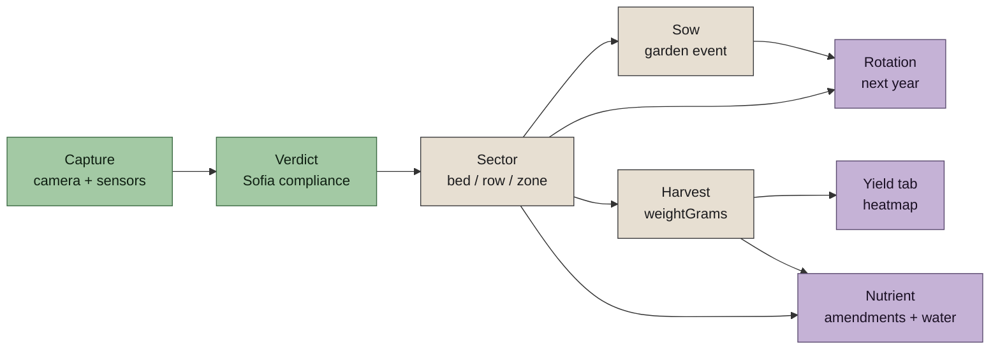
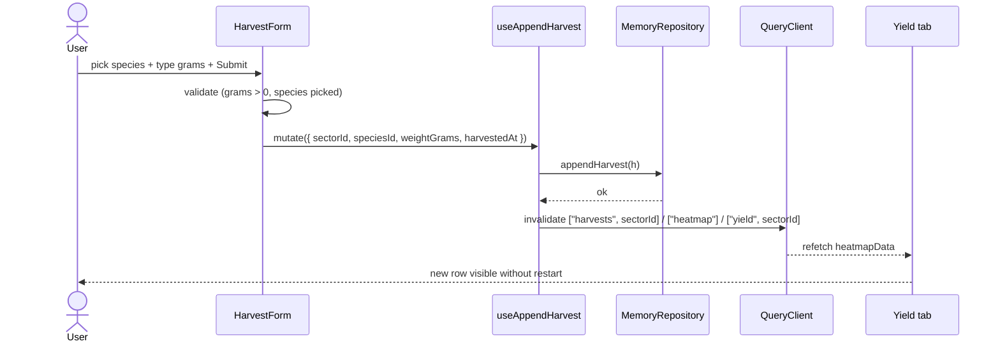
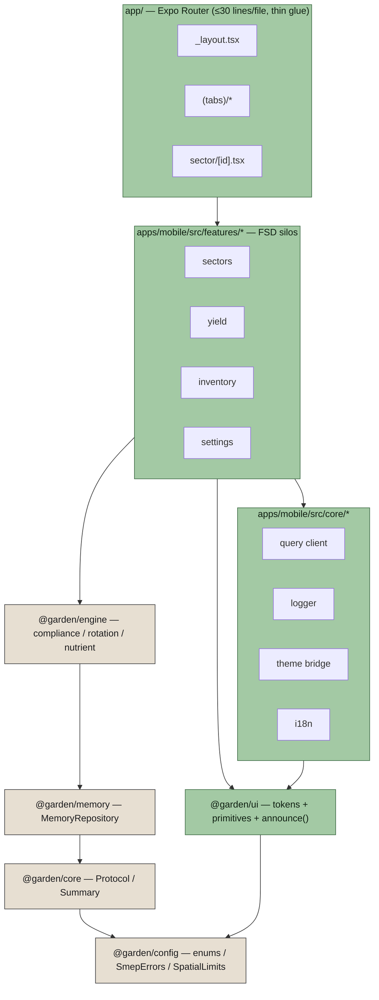
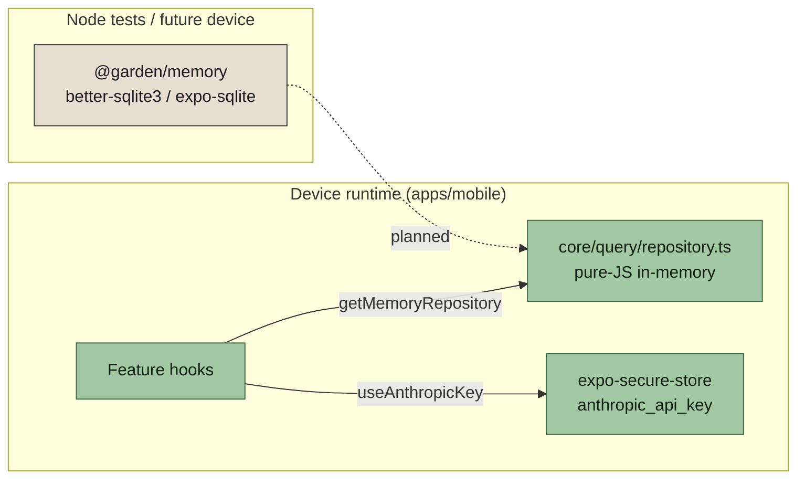

# App flow — what happens, in order

Developer-facing narrative. Reads top to bottom. Use it to get the mental model of the data model before touching the code.

## The chain



Each step writes exactly one row to the right table. The next step reads that row. Nothing is coupled through globals; every hop is a repository call on `MemoryRepository` (see `@garden/memory`).

---

## 1. Capture

**User action:** point the camera at a slope on the Capture tab.

**What the engine does:**

- `capture-driver.ts` reads `expo-camera` frames, `expo-sensors` device motion, `expo-location`.
- It produces a `Protocol` (see `@garden/config/types/protocol.ts`):
  ```ts
  type Protocol = {
    id: string;
    capturedAt: string; // ISO
    confidence: number; // 0..1
    data: ScanData; // slope, orientation, water-table depth, ...
  };
  ```
- `MemoryRepository.saveProtocol(protocol)` stores it with status `TaskStatus.InProgress`.

**Engine pure-logic reference:** `packages/core/src/protocol.ts`.

---

## 2. Verdict

**Engine action:** `@garden/engine/compliance` runs the Sofia rules against the `Protocol`.

- `evaluateTopographyCompliance(plotScan, repository)` checks each `SpatialLimits.*` constant.
- Every branch emits a typed `Summary` via `@garden/core`'s `summary.success / warning / actionRequired / rejection`.
- `MemoryRepository.saveStatus(scanId, status)` updates the scan to one of:
  - `TaskStatus.Verified` — the plan is legal and ecologically sound.
  - `TaskStatus.PendingApproval` — requires a micro-permit (engine generates the spec).
  - `TaskStatus.RequiresIntervention` — biological work needed before grading.
  - `TaskStatus.Failed` — rejected; cites the rule.

Every verdict carries a `sourceCitation`. CI fails on missing citations.

---

## 3. Sector

A **sector** is a user-defined bed, row, or zone on the plot. It is the unit of everything below (rotation, nutrient, yield).

**User action:** **Sectors** tab → **Add sector**. Optional: open a sector → **Rename** or **Delete**.

**Data model:**

```ts
type Sector = {
  id: string;
  plotId: string; // fixed "plot-a" until multi-plot lands
  name: string;
  polygon: ReadonlyArray<{ lat: number; lon: number }>;
  createdAt: string; // ISO
};
```

**Repository calls:**

- `saveSector(sector)`
- `listSectorsByPlot(plotId)`
- `getSector(id)`
- `renameSector(id, name)`
- `deleteSector(id)` — idempotent, does not cascade harvests (kept for year-over-year history).

Polygon is a placeholder four-corner box until the map editor lands. Sectors are still queryable and logged against.

---

## 4. Sow (and other garden events)

**User action:** **Inventory** tab → **Log event** card.

An **event** is any append-only fact about a sector. Sowing, transplanting, a pest sighting, a soil sample, a plant failure, or a correction.

**Data model** (`@garden/config`):

```ts
const EventKind = {
  Acquired,
  Sowed,
  Transplanted,
  Harvested,
  PestObserved,
  SoilSample,
  Correction,
  PlantFailure
} as const;

type InventoryEvent = {
  id: string;
  kind: EventKind;
  capturedAt: string;
  delta: number; // inventory delta (for Acquired / Correction)
  targetRecordId?: string;
  pinId?: string;
  sectorId?: string;
  speciesId?: string;
  pestSpeciesId?: string;
  notes?: string;
};
```

**Repository calls:**

- `appendEvent(event)` — append-only. Corrections are new events, never mutations.
- `listEventsBySector(sectorId)`
- `listEventsInRange(fromIso, toIso)`

A mistake is corrected by a `Correction` event. The history is audit-grade.

---

## 5. Harvest

**User action:** Sectors tab → open a sector → **Log harvest** card.

**Data model:**

```ts
type Harvest = {
  id: string;
  sectorId: string;
  speciesId: string;
  weightGrams: number; // > 0 enforced at the repository
  harvestedAt: string; // ISO
  notes?: string;
};
```

**Repository call:** `appendHarvest(h)` throws `SmepErrors.invalidHarvestWeight` if the weight is zero or negative.

**Read path:** the Yield tab's `useHeatmap` calls `@garden/engine`'s `heatmapData(repo, plotId, year)`, which sums `listHarvestsBySector` across every sector in the plot.



---

## 6. Rotation

**Engine action:** next-year recommendation for a sector.

- `@garden/engine/rotation/rotation-rules.ts` encodes the family-vs-family rules (Solanaceae → not-Solanaceae for 3 years, Fabaceae → Brassicaceae for nitrogen, Allium-after-Brassica, etc.). Each rule carries a `RotationReasonCode` and a `sourceCitation`.
- `@garden/engine/rotation/companions.ts` encodes positive/negative companions.
- `adviseRotation({ sectorId, year, repository })` reads `listEventsBySector` + `listHarvestsBySector`, determines the most recent family planted, and returns `AdviseRotationResult`:
  ```ts
  type AdviseRotationResult = {
    recommendations: ReadonlyArray<{
      speciesId: string;
      score: number;
      reasons: ReadonlyArray<{ code: RotationReasonCode; citation: string }>;
    }>;
  };
  ```

No string-literal unions in the codebase — reasons are `const RotationReasonCode = {...} as const`.

---

## 7. Nutrient + irrigation

**Engine action:** soil + species demand → amendment + watering plan.

- `@garden/engine/nutrient/liebig.ts` — Liebig's Law of the Minimum. Given a `SoilSample` + species demand, returns the `LimitingFactor`.
- `@garden/engine/nutrient/species-demand.ts` — N/P/K/micros demand per species. Every row cites its agronomic source.
- `@garden/engine/nutrient/kc-tables.ts` + `climate-fallback.ts` — FAO-56 Penman-Monteith ET₀ with Sofia climatology fallback when a live station is unavailable.
- `adviseAmendments(input)` returns `AdviseAmendmentsResult`: amendments list (with units, cadence, citations).
- `adviseWater(input)` returns a litres-per-week figure keyed to the current phenology stage.

---

## What layer handles what



Rule: each layer only imports down and sideways within the same layer. The four pure packages (`config`, `core`, `memory`, `engine`) contain **zero React Native / Expo imports** — enforced by ESLint.

---

## Where data lives



- **On device now:** pure-JS in-memory `MemoryRepository` in `apps/mobile/src/core/query/repository.ts`. Every `MemoryRepository` call hits a `Map` or a plain array. Data is lost on app reinstall.
- **Future:** `make-device-sqlite-adapter` change wires `expo-sqlite` with the same migrations the Node test adapter uses today.
- **Anthropic key:** `expo-secure-store`, key `anthropic_api_key`. Masked in UI via the first 7 + last 4 characters.

---

## Summary types — the one non-obvious contract

`Summary` is the engine's way of talking back to the UI. Every engine function that speaks to a user returns a `Summary`:

```ts
const SummaryType = {
  Success: "success",
  Warning: "warning",
  ActionRequired: "actionRequired",
  Rejection: "rejection"
} as const;

type Summary = { type: SummaryType; message: string; meta?: SummaryMeta };
```

The `announce(summary)` helper in `@garden/ui` maps each type to (TTS utterance + persistent caption + haptic pulse) so no information is carried by one sense alone. The `Caption` primitive renders the same four variants as coloured chips.
